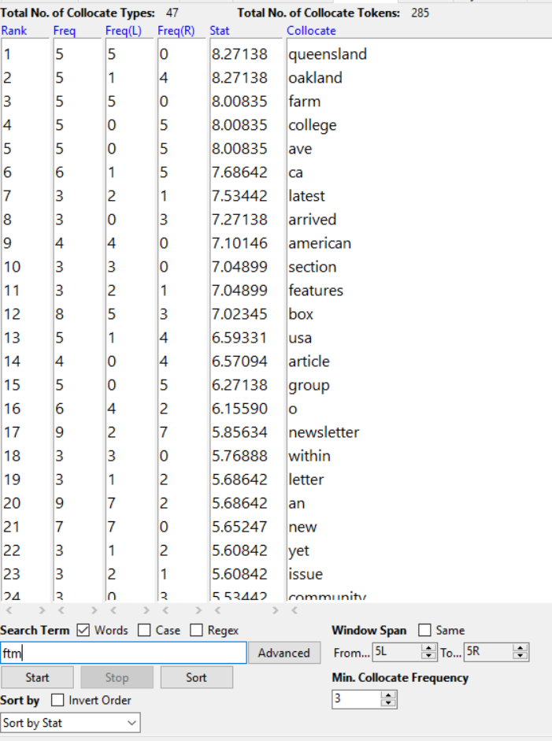
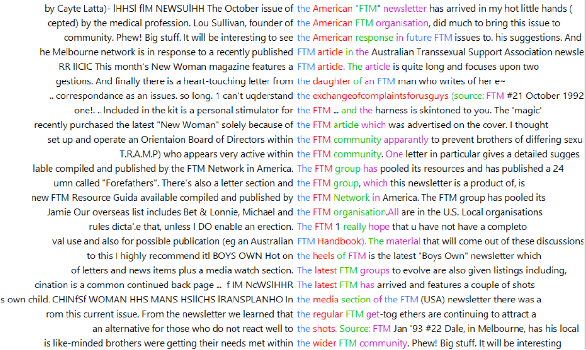
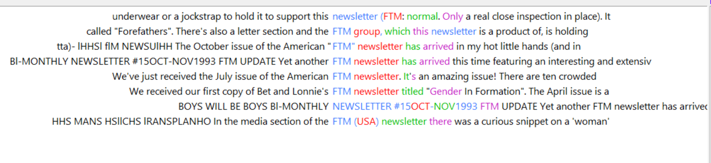
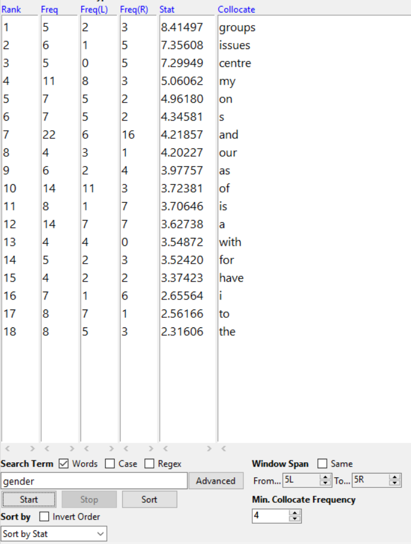

[Home](index.md) | [Week Six](Week6.md) | [Voyant](Voyant.md) | [Conclusion](Conclusion.md)

## AntConc

Based on my findings from using Voyant, I wanted to do a deeper exploration of how the terms "FtM" and "Gender" were used.

#### FtM
Here are all the occurences of FtM in the corpus. [Part 1](Screenshots/AntConcFTM1.png), [Part 2](Screenshots/AntConcFTM2.png), and [Part 3](Screenshots/AntConcFTM3.png) 

When looking at how FtM was used, it collocated the best with the address used by a United States Transsexual group that the group started in Australia communicated with (the first 6 terms relate to this address). 
     

FtM collocated often with  "The" (25 times) as well which was interesting, considering that Michelle Moravec also explored the use of "the". Looking deeper into its use, "The" was mainly used in concordance with "FtM" to refer to other FTM groups, newsletteres, or the wider FTM community. This was interesting to me because it shows how they were connecting with other similar groups.

I saw similar results using the Clusters/N-Grams tool in AntConc. FtM Groups, articles, community, organisation, etc. appeared frequently. The top two most frequent again related to the previously mentioned address.

I was able to use AntConc to further explore a brief hypothesis I had made for when FtM and Newsletters both occured frequently. I hypothesized that when FtM and Newsletter both occured frequently, that it was due to an increase in the headlines, or as references in letters submitted by readers. With AntConc I was able to look into this and found that FTM and Newsletter were primarily used to refer to either the Boys Will be Boys newsletter or other similar Gender newsletters.

#### Gender

Here are all the occurences of Gender being used in the corpus: [Part 1](Screenshots/AntConcGender1.png) and [Part 2](Screenshots/AntConcGender2.png).

The term that collocated the best with "Gender" was "Group" which was not surprising to me, since it makes sense that this group would seek out and recommend other like-minded groups. Similarly, "Issues" was the second best collocating term with "Gender". This was unsurprising since this group was focused on certain gender issues so it is only logical that they mention other Gender Issues publications and groups.

Unfortunately AntConc did not list "FtM" as a term that collocated with "Gender" so I could not explore my hypothesis of FtM and Gender being used frequently in the same documents be because of letters submitted by readers detailing more about their lives and experiences with gender as an FtM.

Full Results can be seen [here](https://voyant-tools.org/?corpus=16ca32d63ed3573f7317c370e4c9d5bd)

[Home](index.md) | [Week Six](Week6.md) | [Voyant](Voyant.md) | [Conclusion](Conclusion.md)
