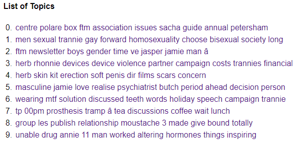

[Home](index.md) | [Week Six](Week6.md) | [AntConc](AntConc.md) | [Conclusion](Conclusion.md)

## Voyant
In Voyant, I mainly wanted to look at the Cirrus to look at what terms occured the most, so that it could guide my area of focus. I did this by looking at the Cirrus, Trends, TermsBerry, and Topic tools in Voyant. The Topic tool was mainly just because I wanted to see what it would provide versus the Topic Modelling tool.

### Cirrus
<iframe style='width: 588px; height: 502px;' src='https://voyant-tools.org/tool/Cirrus/?corpus=16ca32d63ed3573f7317c370e4c9d5bd'></iframe>

Using Cirrus, I was slightly disapointed that there were no terms that were used significantly more than others. For example the most used term "FtM, was used 56 times, and the 10th most used term "man" was used 32 times. This may be due to the relatively small sample size, only 17,457 words, and probably actually less than that if I were to do a proper cleaning of the data. However it still gave me some direction to focus my research. I disregarded newsletter, and boys, since this is the "Boys Will be Boys Newsletter" so those terms will be used often. I probably should have put them on the ignore list, but I thought it would be interesting to see how often it was used, either as a headline or as referenced by readers describing the newsletter in their letters. 

### Trends
<iframe style='width: 638px; height: 502px;' src='https://voyant-tools.org/tool/Trends/?query=ftm&query=newsletter&query=boys&query=new&query=gender&corpus=16ca32d63ed3573f7317c370e4c9d5bd'></iframe>

I personally like the Trends tool as a way to see how often the terms are used in each document. I found it interesting how sometimes when FtM was used more relatively in a document, newsletter would also be more frequent, but in others Gender would be more prevalent. I think this shows how the terms were used in different contexts. When FtM and Newsletter were used more often, it is likely that there were more references to the FtM Newsletter, probably by readers in their letters to the editor. Or maybe FtM and Gender were used relatively more, the newsletters dealt with more letters or articles describing their lives.
A way to further advance this research would be to organize the documents in a chronological order to see if there is a rise or fall in term usage as time passed and the editors and readers became more comfortable in this space.

### TermsBerry
<iframe style='width: 636px; height: 502px;' src='https://voyant-tools.org/tool/TermsBerry/?stopList=keywords-bcc95d829f38decf41473bc784947d95&context=10&numInitialTerms=25&corpus=16ca32d63ed3573f7317c370e4c9d5bd'></iframe>

I am also a fan of the TermsBerry tool, but I have usually used it on a larger corpus. The TermsBerry tool visualizes high frequency terms and how those terms co-occur with one another. However this analysis does not seem particularly suited to this corpus as there are no terms that are super high frequency in relation to the rest of the terms. One thing this does represent well though is how the term "Jamie" who was the main editor, is connected to so many of the other high frequency terms. It shows how they wrote about many different topics. It also shows how herb and rhonnie are connected. Using AntConc to look further into the documents, it reveals that Rhonnie was selling a prosthetic penis for FtM transgendered people called the H.E.R.B.. This tool may be of more use if the corpus was expanded, or it could potentially be used to delve into a micro view of the text if one was driven to uncover the fine intricacies of this corpus. 

### Topic
<iframe style='width: 958px; height: 323px;' src='https://voyant-tools.org/tool/Topics/?stopList=keywords-bcc95d829f38decf41473bc784947d95&numTopics=10&corpus=16ca32d63ed3573f7317c370e4c9d5bd'></iframe>

I mainly only ran this tool since I had not realized Voyant offered a Topics tool and I wanted to see what the results looked like compared to the TopicModellingTool we used in the class. I did not put any effort into analyzing the differences between the two since I had already devoted time to using wget, Voyant, and AntConc and was on limited time. Someone could take these and run them themselves to analyze the differences between the two generated topic lists.

The TopicModellingTool  ran at 400 iterations and gave this result:

From using Voyant to look at the Macro view of the text, I uncovered some potential areas of interest to explore with a zoomed in view of the text to explore with AntConc.

[Home](index.md) | [Week Six](Week6.md) | [AntConc](AntConc.md) | [Conclusion](Conclusion.md)
